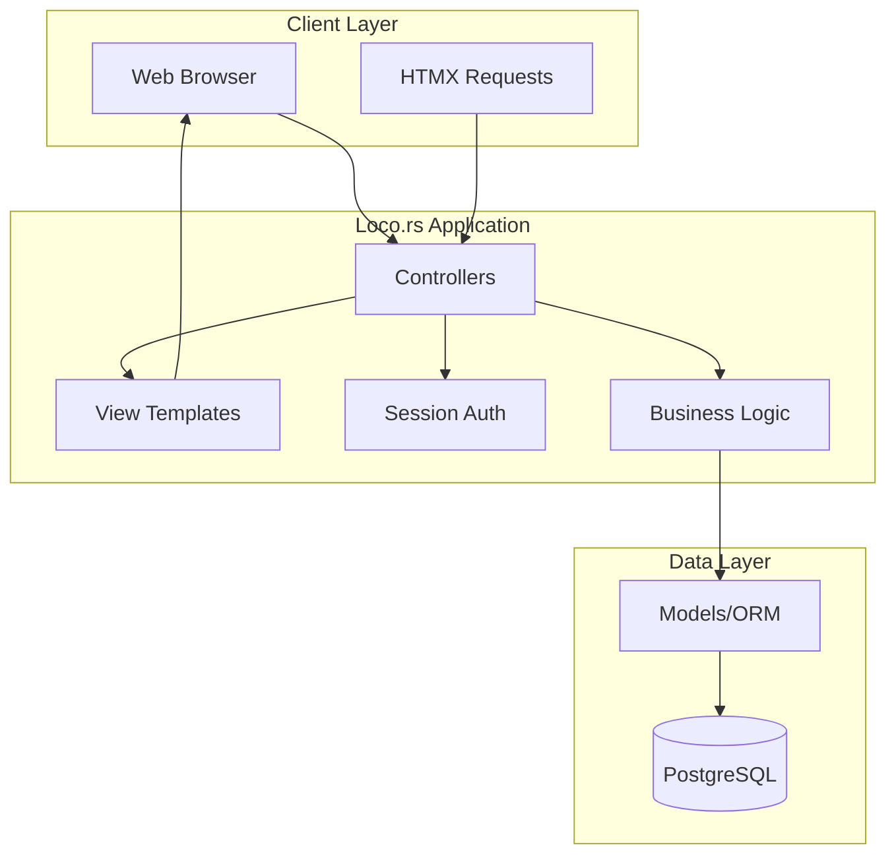

# 研修管理システム アーキテクチャ設計

## システム概要

IT技術研修を提供する企業向けの研修管理Webアプリケーション。研修コースの管理から実施、受講者の進捗管理、個別面談・定例会の管理までを一元化し、効率的な研修運営を支援する。

## アーキテクチャパターン

- **パターン**: モノリシック MVC + HTMX
- **理由**: 
  - Loco.rsのView機能を活用したサーバーサイドレンダリング
  - HTMXによるシームレスなUI更新
  - フロントエンド/バックエンド分離の不要
  - シンプルなデプロイメントと保守性

## システム構成図



## コンポーネント構成

### バックエンド（Loco.rs モノリシック）

#### **フレームワーク**: Loco.rs (Rust)
- **理由**: 高パフォーマンス、メモリ安全性、型安全性
- **構成**: MVC パターンベース + サーバーサイドレンダリング

#### **認証方式**: セッションベース認証
- Cookie + サーバーサイドセッション管理
- セッションデータのPostgreSQL保存
- 役割ベースアクセス制御（RBAC）

#### **主要コンポーネント**:

1. **Controllers**: HTTPリクエスト処理とViewレンダリング
   - AuthController: 認証・ログイン・ログアウト
   - DashboardController: ダッシュボード表示
   - UserController: ユーザー管理画面
   - MaterialController: 教材管理画面
   - TrainingController: 研修コース管理画面
   - CompanyController: 企業管理画面
   - StudentController: 受講者管理画面
   - ProjectController: 実施研修管理画面
   - InterviewController: 個別面談管理画面
   - MeetingController: 定例会管理画面

2. **Views**: HTMLテンプレート + HTMX統合
   - レイアウトテンプレート（共通ヘッダー・フッター）
   - ページテンプレート（フル画面描画）
   - パーシャルテンプレート（HTMX部分更新用）
   - コンポーネントテンプレート（再利用可能部品）

3. **Services**: ビジネスロジック層
   - UserService: ユーザー関連処理
   - TrainingService: 研修関連処理
   - InterviewService: 面談管理処理
   - NotificationService: 通知処理

4. **Models**: データモデル層
   - User, Material, Training, Company, Student, Project, Interview, Meeting
   - ORM統合によるデータベースアクセス

5. **Middleware**: 横断的関心事
   - AuthenticationMiddleware: セッション認証チェック
   - AuthorizationMiddleware: 役割ベース認可チェック
   - CSRFMiddleware: CSRF攻撃防止
   - LoggingMiddleware: ログ記録
   - HTMXMiddleware: HTMX特有のヘッダー処理

### フロントエンド (Loco.rs Views + HTMX)

#### **技術スタック**:
- **テンプレートエンジン**: Loco.rs組み込みテンプレート (Tera/Handlebars)
- **動的UI**: HTMX
- **スタイリング**: Tailwind CSS または Bootstrap
- **コンポーネント**: 部分テンプレートによるコンポーネント化

#### **主要画面テンプレート**:
- login.html / dashboard.html
- users/ (list.html, form.html, detail.html)
- materials/ (list.html, form.html, detail.html)
- trainings/ (list.html, form.html, detail.html)
- companies/ (list.html, form.html, detail.html)
- students/ (list.html, form.html, detail.html)
- projects/ (list.html, form.html, detail.html)
- interviews/ (list.html, form.html, detail.html)
- meetings/ (list.html, form.html, detail.html)

#### **HTMX機能**:
- フォームの非同期送信
- ページの部分更新
- モーダルダイアログ表示
- リアルタイムバリデーション

### データベース

#### **DBMS**: PostgreSQL 15+
- **理由**: ACID準拠、豊富な機能、JSONサポート、スケーラビリティ

#### **セッション管理**: PostgreSQLベース
- セッションデータのDB保存
- Cookieベースのセッション ID管理
- シンプルなキャッシュはアプリケーションレベルで実装


## セキュリティ設計

### 認証・認可
- **セッションベース認証**: Cookie + サーバーサイドセッション
- **RBAC**: 管理者、研修担当者、研修講師の役割分離
- **CSRF対策**: フォームトークンとHTMX統合

### データ保護
- **パスワードハッシュ化**: bcrypt
- **HTTPS通信**: 全通信の暗号化
- **入力検証**: SQLインジェクション、XSS対策
- **HTMX セキュリティ**: 適切なヘッダー設定

### データアクセス制御
- 企業データの分離（マルチテナント考慮）
- 個人情報の適切なマスキング
- 監査ログの記録

## パフォーマンス設計

### データベース最適化
- 適切なインデックス設計
- クエリの最適化
- コネクションプーリング

### パフォーマンス最適化
- サーバーサイドテンプレートキャッシュ
- データベースクエリの最適化
- 静的アセットのCDN配信
- HTMXリクエストの効率的な処理

### スケーラビリティ
- 水平スケーリング対応設計
- ロードバランシング対応

## 開発・運用環境

### 開発環境
```
Docker Compose:
  - Loco.rs Monolithic App
  - PostgreSQL
  - File Storage Volume
```

### 本番環境（AWS）
```
AWS ECS:
  - Loco.rs Monolithic App
  - Auto Scaling
  
AWS RDS:
  - PostgreSQL
  - Multi-AZ配置
  
  
AWS CloudFront:
  - 静的アセット配信
```

## ルーティング設計原則

### MVCパターン
- **Controller**: HTTPリクエスト処理とViewレンダリング
- **Model**: データアクセスとビジネスロジック
- **View**: HTMLテンプレートとHTMX統合

### URL設計
```
GET  /login           - ログインフォーム
POST /login           - ログイン処理
GET  /dashboard        - ダッシュボード
GET  /users           - ユーザー一覧
GET  /users/new       - ユーザー作成フォーム
POST /users           - ユーザー作成処理
GET  /users/:id/edit  - ユーザー編集フォーム
...
```

### HTMXエンドポイント
- 部分更新用のフラグメントレスポンス
- JSON APIは最小限（検索オートコンプリート等）

## 監視・ログ

### アプリケーション監視
- ヘルスチェックエンドポイント
- メトリクス収集（レスポンス時間、エラー率）
- アラート設定

### ログ管理
- 構造化ログ（JSON形式）
- ログレベル分離（ERROR, WARN, INFO, DEBUG）
- 監査ログの記録

## データ移行・バックアップ

### データ移行
- マイグレーションスクリプト管理
- ロールバック機能
- データ整合性チェック

### バックアップ戦略
- 定期自動バックアップ
- Point-in-time リカバリ
- 災害復旧計画

## 今後の拡張性

### 将来機能への対応
- プログラム管理機能（複数プロジェクト束ね）
- Googleカレンダー連携
- 受講者向けアプリケーション（別モノリシックアプリ）
- より詳細な進捗分析機能

### 技術的拡張
- コンポーネントライブラリの充実
- リアルタイム通知機能（WebSocket + HTMX）
- PWA対応でのモバイル体験向上
- APIエンドポイントの部分的提供（必要に応じて）

## HTMXガイドライン（必要最小限利用）

### テンプレート設計
- ベーステンプレート：共通レイアウト
- ページテンプレート：サーバーサイドレンダリング中心
- パーシャルテンプレート：必要最小限の部分更新
- コンポーネントテンプレート：再利用部品

### HTMX活用パターン（必要最小限）
- フォームバリデーションのライブフィードバック
- 検索結果の動的表示
- 必要なモーダル表示
- シンプルな部分更新

### 設計原則
- サーバーサイドレンダリングを基本とする
- HTMXは必要最小限の改善のみに使用
- 安定性と保守性を優先
- APIエンドポイントは必要最小限とする

この設計により、シンプルで保守しやすいモノリシックアプリケーションを構築し、必要最小限のHTMXで軽量なUI改善を提供できます。