# 研修管理システム データフロー図

## システム全体フロー

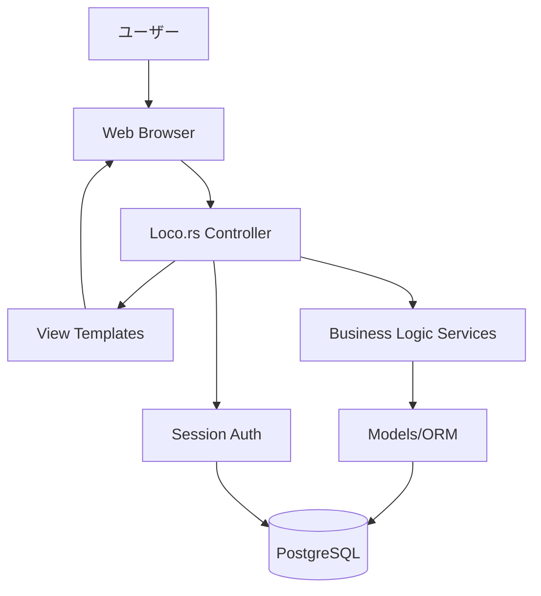

## 認証フロー

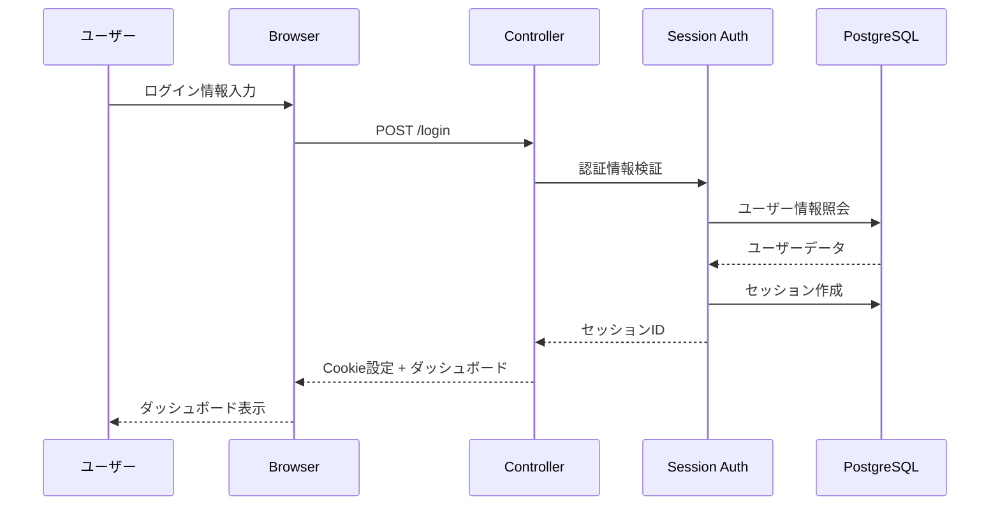

## 教材管理フロー

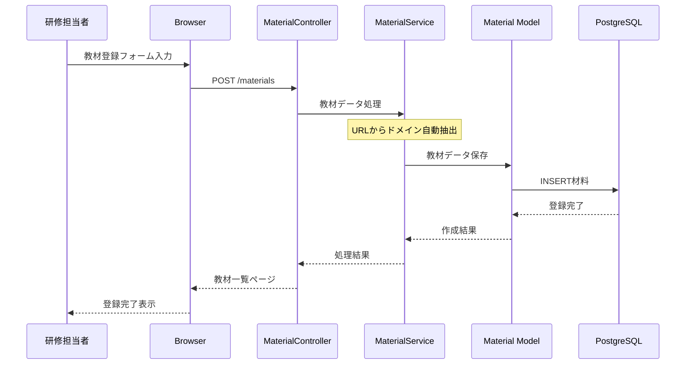

## 研修コース設計フロー

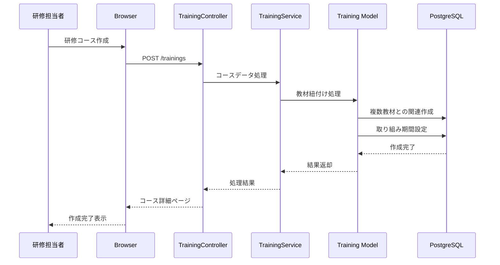

## プロジェクト実施管理フロー

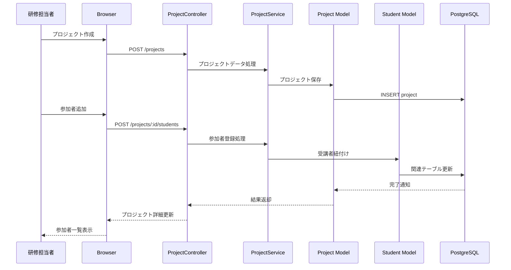

## 面談管理フロー

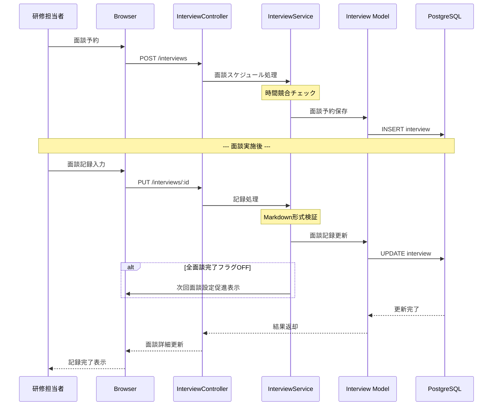

## 定例会管理フロー

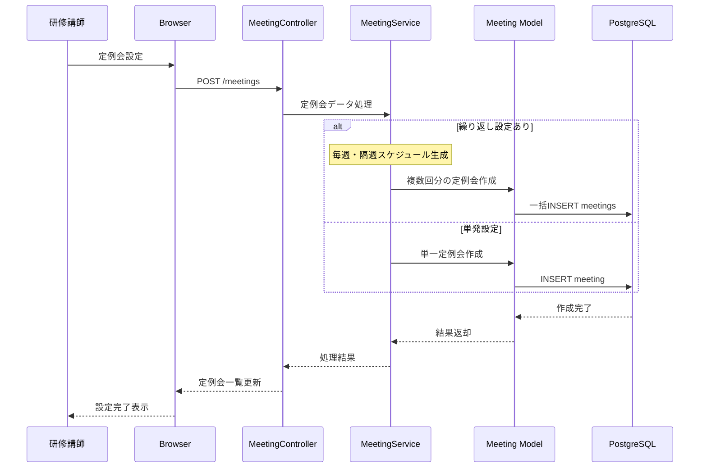

## 権限制御フロー

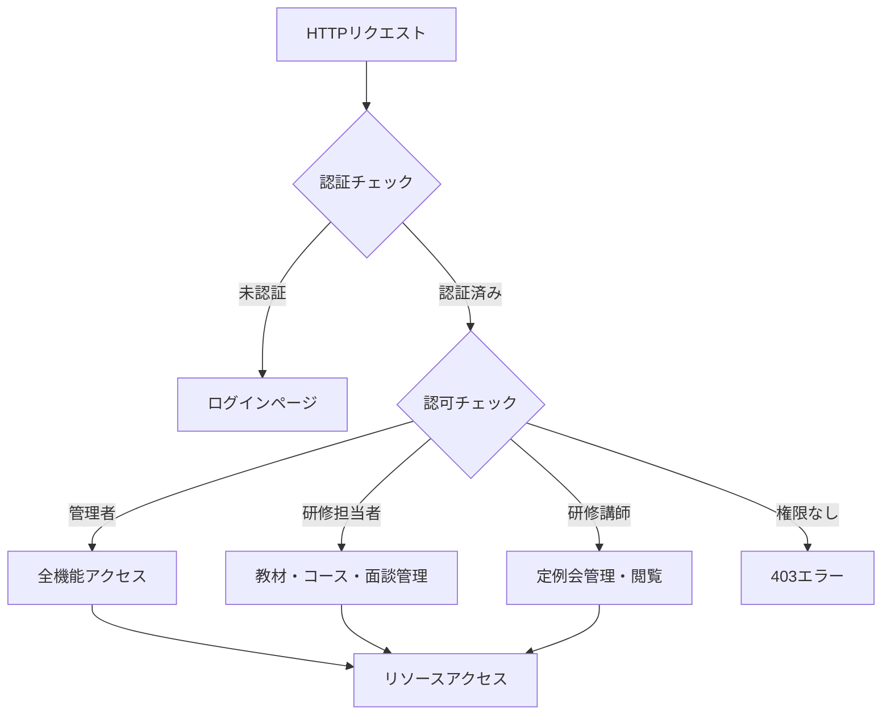

## データアクセスパターン

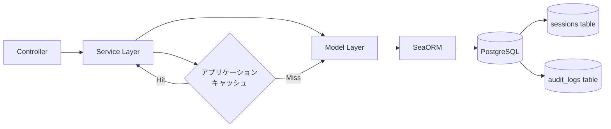

## エラーハンドリングフロー

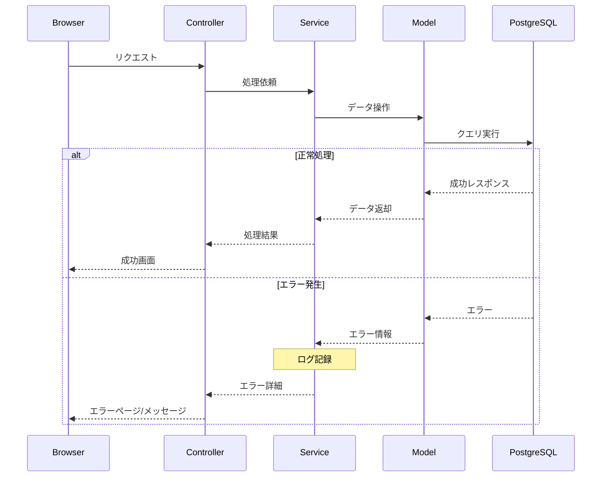

## HTMX部分更新フロー（必要最小限）

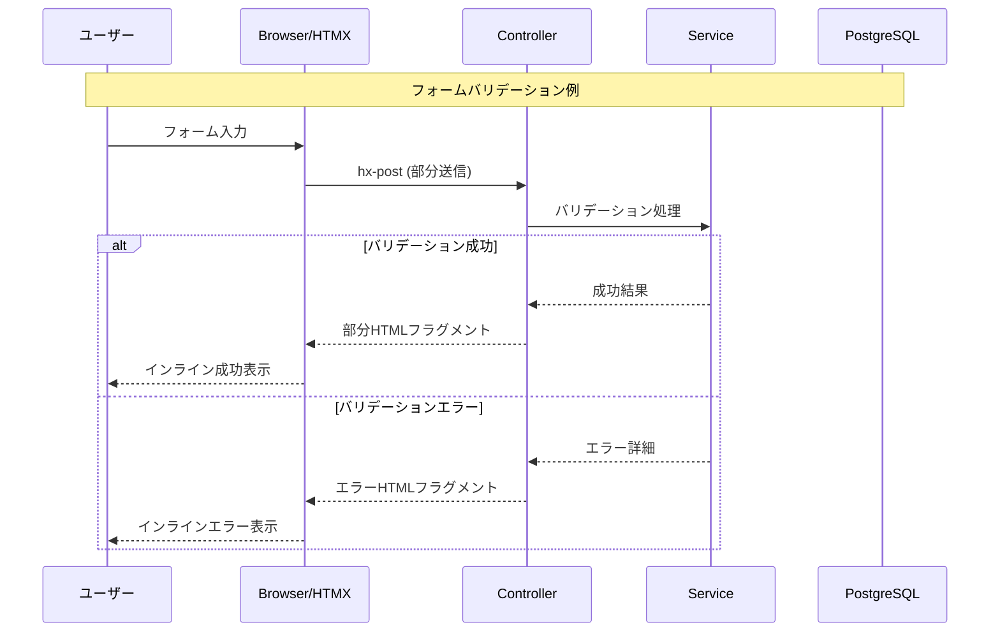

## セッション管理フロー

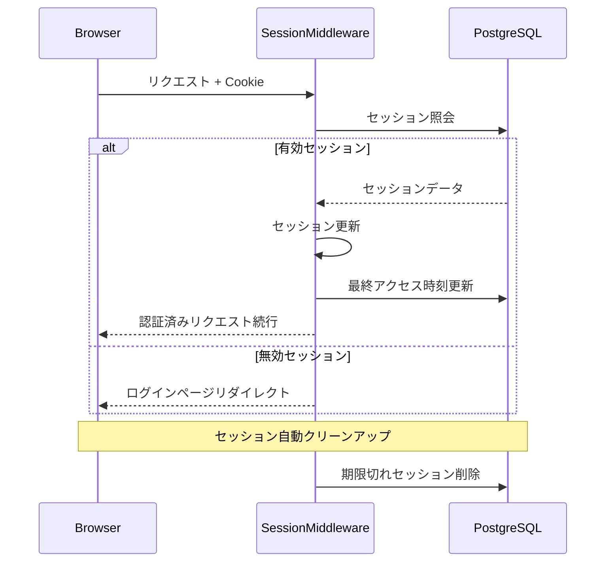

これらのデータフローにより、研修管理システムの各機能における処理の流れと、モノリシック構成でのシンプルな通信パターンが明確になります。