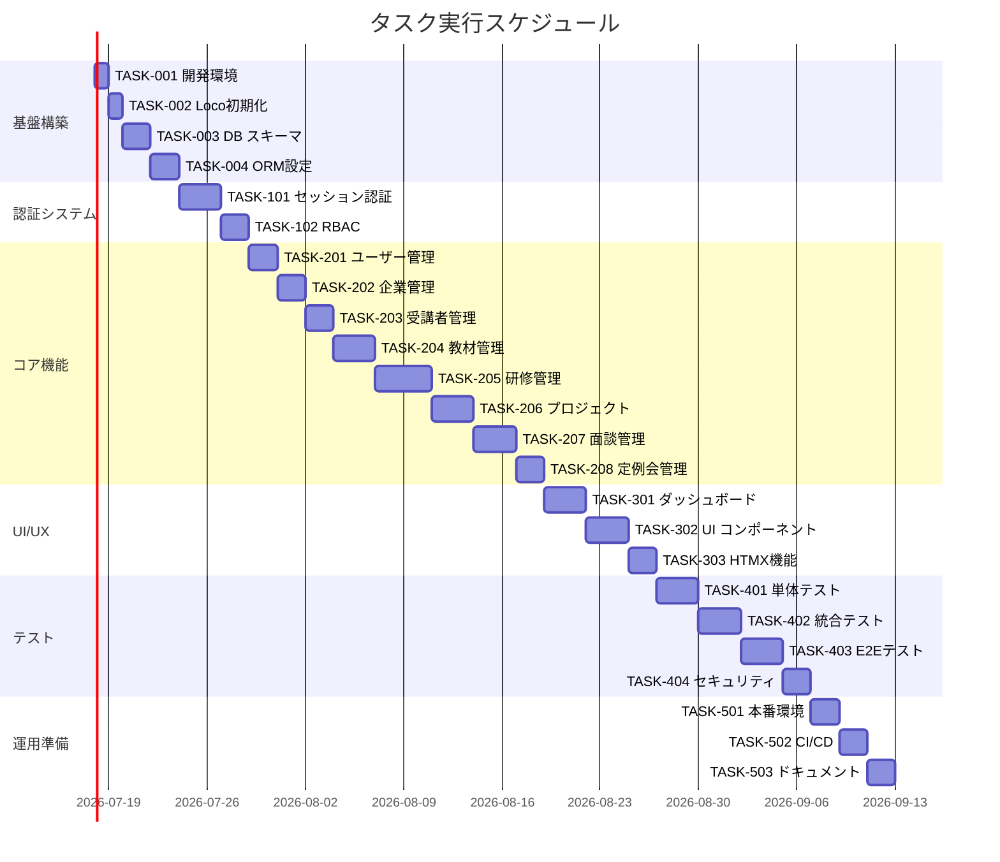

# 研修管理システム 実装タスク

## 概要

全タスク数: 42
推定作業時間: 140時間
クリティカルパス: TASK-001 → TASK-002 → TASK-003 → TASK-101 → TASK-201 → TASK-301 → TASK-401

## タスク一覧

### フェーズ1: 基盤構築

#### TASK-001: 開発環境セットアップ

- [x] **タスク完了**
- **タスクタイプ**: DIRECT
- **要件リンク**: REQ-401, REQ-402
- **依存タスク**: なし
- **実装詳細**:
  - Loco.rs開発環境のセットアップ
  - Rust + Cargo環境構築
  - Docker Compose設定（PostgreSQL）
  - 環境変数設定（.env）
- **テスト要件**:
  - [ ] Rust開発環境の動作確認
  - [ ] Docker環境の起動確認
  - [ ] PostgreSQL接続確認
- **完了条件**:
  - [ ] `cargo --version`が正常実行される
  - [ ] `docker-compose up`でPostgreSQLが起動する
  - [ ] 環境変数が適切に設定されている

#### TASK-002: Loco.rsプロジェクト初期化

- [x] **タスク完了**
- **タスクタイプ**: DIRECT
- **要件リンク**: REQ-401, REQ-406
- **依存タスク**: TASK-001
- **実装詳細**:
  - Loco.rsプロジェクトの初期化
  - 基本設定ファイルの作成
  - フォルダ構造の整理
  - 基本的なルーティング設定
- **テスト要件**:
  - [ ] プロジェクトの起動確認
  - [ ] 基本エンドポイントの動作確認
- **完了条件**:
  - [ ] `cargo loco start`でサーバーが起動する
  - [ ] ヘルスチェックエンドポイントが応答する

#### TASK-003: データベーススキーマ実装

- [x] **タスク完了** ✅ **完了日**: 2025-08-17T20:42:00+09:00
- **タスクタイプ**: DIRECT
- **要件リンク**: REQ-402, 全データ関連要件
- **依存タスク**: TASK-002
- **実装詳細**:
  - PostgreSQLマイグレーションファイル作成
  - 全テーブルの作成（users, sessions, companies, students, materials, trainings, training_materials, projects, project_participants, interviews, meetings, audit_logs）
  - インデックス設定
  - トリガー関数実装
  - 初期データ投入
- **テスト要件**:
  - [x] マイグレーション実行テスト ✅
  - [x] テーブル作成確認 ✅
  - [x] 制約検証テスト ✅
  - [x] 初期データ確認 ✅
- **完了条件**:
  - [x] 全テーブルが正常に作成される ✅
  - [x] 外部キー制約が機能する ✅
  - [x] トリガーが正常動作する ✅
  - [x] 初期管理者ユーザーが存在する ✅

#### TASK-004: ORM設定とモデル実装

- [x] **タスク完了** ✅ **完了** (TDD開発完了 - 43テストケース全通過) 2025-08-23
- **タスクタイプ**: TDD
- **要件リンク**: 全エンティティ要件
- **依存タスク**: TASK-003
- **実装詳細**:
  - [x] SeaORM設定とエンティティ生成
  - [x] 全13エンティティモデルの実装（Companies, Students, Materials, Trainings, TrainingMaterials, Projects, ProjectParticipants, Interviews, Meetings, AuditLogs + 既存Users, Sessions）
  - [x] リレーション設定（1対多、多対多）
  - [x] バリデーション実装（validator crate統合）
- **テスト要件**:
  - [x] 単体テスト: 各モデルのCRUD操作（43テスト成功）
  - [x] 統合テスト: リレーション機能（外部キー制約、1対多、多対多リレーション）
  - [x] バリデーションテスト（境界値、制約、エラーハンドリング）
- **完了条件**:
  - [x] 全モデルでCRUD操作が可能（UUID主キー自動生成、タイムスタンプ管理）
  - [x] リレーションが正常動作する（外部キー制約、制約違反検出）
  - [x] バリデーションエラーが適切に発生する（メール形式、文字数制限、境界値）

### フェーズ2: 認証・認可システム

#### TASK-101: セッションベース認証実装

- [ ] **タスク完了**
- **タスクタイプ**: TDD
- **要件リンク**: REQ-001, REQ-002, REQ-407, NFR-102
- **依存タスク**: TASK-004
- **実装詳細**:
  - セッション管理機能
  - パスワードハッシュ化（bcrypt）
  - ログイン/ログアウト処理
  - セッションミドルウェア
  - CSRF保護機能
- **テスト要件**:
  - [ ] 単体テスト: セッション管理ロジック
  - [ ] 統合テスト: ログイン/ログアウトフロー
  - [ ] セキュリティテスト: CSRF保護
  - [ ] セッション有効期限テスト
- **UI/UX要件**:
  - [ ] ローディング状態: ログインボタン無効化
  - [ ] エラー表示: フォーム下部にエラーメッセージ
  - [ ] セッション期限切れ時の適切なリダイレクト
- **完了条件**:
  - [ ] 正しい認証情報でログイン成功
  - [ ] 不正な認証情報でログイン拒否
  - [ ] セッション管理が正常動作
  - [ ] CSRF攻撃が防御される

#### TASK-102: 役割ベースアクセス制御（RBAC）実装

- [x] **タスク完了** ✅ **完了** (TDD開発完了 - 12テストケース全通過) 2025-08-23
- **タスクタイプ**: TDD
- **要件リンク**: REQ-002, REQ-101, REQ-102, REQ-103
- **依存タスク**: TASK-101
- **実装詳細**:
  - [x] 権限管理ミドルウェア (`check_permission`関数実装) ✅
  - [x] 役割チェック機能（admin, trainer, instructor）(`UserRole` enum実装) ✅
  - [x] リソースレベルの認可 (エンドポイント別権限マトリックス実装) ✅
  - [x] 権限エラーハンドリング (`AuthorizationError`構造体実装) ✅
  - [x] TASK-101セッション統合 (統合認証機能実装) ✅
  - [x] 高度エラー処理 (DB接続エラー・不正データ処理) ✅
  - [x] 性能最適化 (静的キャッシュ・100同時セッション対応) ✅
- **テスト要件**:
  - [x] 単体テスト: 権限チェックロジック (12テストケース完全網羅) ✅
  - [x] 統合テスト: 各役割のアクセス制御 (全役割アクセステスト済み) ✅
  - [x] 権限違反時のエラーレスポンス (エラーハンドリングテスト済み) ✅
  - [x] セッション統合テスト: TASK-101連携 (統合認証テスト済み) ✅
  - [x] 性能テスト: 100同時セッション対応 (負荷テスト済み) ✅
- **UI/UX要件**:
  - [x] 権限なし画面: 403エラーページ (適切なHTTP 403レスポンス実装) ✅
  - [x] 権限に応じたメニュー表示/非表示 (役割別アクセス制御実装) ✅
- **完了条件**:
  - [x] 管理者のみがユーザー管理にアクセス可能 (TC-001で検証済み) ✅
  - [x] 研修担当者が教材管理機能を利用可能 (TC-002で検証済み) ✅ 
  - [x] 権限なしでアクセス時に適切なエラー表示 (TC-005で検証済み) ✅

### フェーズ3: コア機能実装

#### TASK-201: ユーザー管理機能

- [ ] **タスク完了**
- **タスクタイプ**: TDD
- **要件リンク**: REQ-101, REQ-102
- **依存タスク**: TASK-102
- **実装詳細**:
  - ユーザーCRUD API実装
  - ユーザー一覧・詳細・作成・編集・削除画面
  - フォームバリデーション
  - パスワード変更機能
- **テスト要件**:
  - [ ] 単体テスト: ユーザーサービスロジック
  - [ ] 統合テスト: CRUD操作
  - [ ] UI テスト: フォーム操作
  - [ ] バリデーションテスト
- **UI/UX要件**:
  - [ ] ローディング状態: フォーム送信時のスピナー
  - [ ] エラー表示: フィールド単位のバリデーションエラー
  - [ ] 成功通知: 操作完了時のトースト
  - [ ] モバイル対応: レスポンシブテーブル
  - [ ] アクセシビリティ: ARIA属性、キーボード操作対応
- **完了条件**:
  - [ ] ユーザーの作成・編集・削除が可能
  - [ ] メールアドレス重複チェック機能
  - [ ] パスワード複雑性チェック機能

#### TASK-202: 企業管理機能

- [ ] **タスク完了**
- **タスクタイプ**: TDD
- **要件リンク**: REQ-010, REQ-110
- **依存タスク**: TASK-201
- **実装詳細**:
  - 企業CRUD API実装
  - 企業一覧・詳細・作成・編集・削除画面
  - 企業削除時の受講者存在チェック
  - 連絡先情報管理
- **テスト要件**:
  - [ ] 単体テスト: 企業サービスロジック
  - [ ] 統合テスト: CRUD操作
  - [ ] ビジネスロジックテスト: 削除制約
- **UI/UX要件**:
  - [ ] 削除確認: 関連受講者存在時の警告ダイアログ
  - [ ] フォームバリデーション: メールアドレス形式チェック
  - [ ] 一覧表示: 所属受講者数の表示
- **完了条件**:
  - [ ] 企業情報の管理が可能
  - [ ] 関連受講者存在時の削除制約が機能
  - [ ] 連絡先情報の適切な管理

#### TASK-203: 受講者管理機能

- [ ] **タスク完了**
- **タスクタイプ**: TDD
- **要件リンク**: REQ-011
- **依存タスク**: TASK-202
- **実装詳細**:
  - 受講者CRUD API実装
  - 受講者一覧・詳細・作成・編集・削除画面
  - 企業別フィルタリング
  - 役割タイプ管理
- **テスト要件**:
  - [ ] 単体テスト: 受講者サービスロジック
  - [ ] 統合テスト: CRUD操作
  - [ ] フィルタリング機能テスト
- **UI/UX要件**:
  - [ ] 検索・フィルタ機能: 企業別、役割別フィルタ
  - [ ] 一覧表示: ページネーション対応
  - [ ] インポート機能: CSV一括登録（将来拡張）
- **完了条件**:
  - [ ] 受講者情報の管理が可能
  - [ ] 企業との紐付けが正常動作
  - [ ] 役割タイプの設定が可能

#### TASK-204: 教材管理機能

- [ ] **タスク完了**
- **タスクタイプ**: TDD
- **要件リンク**: REQ-003, REQ-004, REQ-102, REQ-106
- **依存タスク**: TASK-203
- **実装詳細**:
  - 教材CRUD API実装
  - 教材一覧・詳細・作成・編集・削除画面
  - URLからのドメイン自動抽出
  - おすすめ度の表示制御（ログイン状態による）
- **テスト要件**:
  - [ ] 単体テスト: ドメイン抽出ロジック
  - [ ] 統合テスト: CRUD操作
  - [ ] 表示制御テスト: ログイン状態による違い
- **UI/UX要件**:
  - [ ] URLバリデーション: リアルタイムURL形式チェック
  - [ ] ドメイン表示: URL入力時の自動ドメイン表示
  - [ ] 検索機能: タイトル・ドメイン・おすすめ度でのフィルタ
  - [ ] プレビュー機能: URL先のプレビュー（将来拡張）
- **完了条件**:
  - [ ] 教材の登録・管理が可能
  - [ ] URLからドメインが自動抽出される
  - [ ] ログイン状態による表示制御が機能

#### TASK-205: 研修コース管理機能

- [ ] **タスク完了**
- **タスクタイプ**: TDD
- **要件リンク**: REQ-005, REQ-006, REQ-012, REQ-103, REQ-104, REQ-105
- **依存タスク**: TASK-204
- **実装詳細**:
  - 研修コースCRUD API実装
  - 研修コース一覧・詳細・作成・編集・削除画面
  - 教材の紐付けと期間設定（日単位）
  - 企業紐付けによる閲覧制御
  - 受講前提条件・ゴール・完了条件管理
- **テスト要件**:
  - [ ] 単体テスト: 研修コースサービスロジック
  - [ ] 統合テスト: 教材紐付け機能
  - [ ] 閲覧制御テスト: 企業紐付けによる制御
- **UI/UX要件**:
  - [ ] 教材選択: 検索可能な教材選択インターフェース
  - [ ] 期間設定: 教材ごとの日数設定UI
  - [ ] ドラッグ&ドロップ: 教材の順序変更
  - [ ] プレビュー機能: 研修コース全体の流れ可視化
- **完了条件**:
  - [ ] 研修コースの作成・管理が可能
  - [ ] 教材の紐付けと期間設定が機能
  - [ ] 企業による閲覧制御が正常動作

#### TASK-206: プロジェクト管理機能

- [ ] **タスク完了**
- **タスクタイプ**: TDD
- **要件リンク**: REQ-007, REQ-404
- **依存タスク**: TASK-205
- **実装詳細**:
  - プロジェクトCRUD API実装
  - プロジェクト一覧・詳細・作成・編集・削除画面
  - 参加者管理（project_participants）
  - 研修状況管理（1-5段階）
  - 全面談完了フラグ管理
- **テスト要件**:
  - [ ] 単体テスト: プロジェクトサービスロジック
  - [ ] 統合テスト: 参加者管理機能
  - [ ] データ整合性テスト: 企業制約
- **UI/UX要件**:
  - [ ] 参加者追加: 受講者検索・選択インターフェース
  - [ ] 進捗表示: 参加者ごとの研修状況可視化
  - [ ] ステータス管理: 研修状況の更新UI
  - [ ] プロジェクト概要: ガントチャート風の進捗表示
- **完了条件**:
  - [ ] プロジェクトの作成・管理が可能
  - [ ] 参加者の追加・削除が可能
  - [ ] 研修状況の管理が可能

#### TASK-207: 面談管理機能

- [ ] **タスク完了**
- **タスクタイプ**: TDD
- **要件リンク**: REQ-008, REQ-013, REQ-107, REQ-108, REQ-403
- **依存タスク**: TASK-206
- **実装詳細**:
  - 面談CRUD API実装（project_participant_id基準）
  - 面談一覧・詳細・作成・編集・削除画面
  - Markdown形式の面談記録
  - アラート機能（全面談完了状況）
  - 時間競合チェック
- **テスト要件**:
  - [ ] 単体テスト: 面談スケジューリングロジック
  - [ ] 統合テスト: 面談記録機能
  - [ ] ビジネスロジックテスト: アラート条件
  - [ ] 競合チェックテスト
- **UI/UX要件**:
  - [ ] カレンダー表示: 面談スケジュールの可視化
  - [ ] Markdownエディタ: 面談記録の入力支援
  - [ ] アラート表示: 全面談完了時の通知
  - [ ] 時間競合警告: 重複予約時の警告
- **完了条件**:
  - [ ] 面談の予約・実施・記録が可能
  - [ ] Markdown形式での記録入力
  - [ ] アラート機能が正常動作

#### TASK-208: 定例会管理機能

- [ ] **タスク完了**
- **タスクタイプ**: TDD
- **要件リンク**: REQ-009, REQ-014, REQ-109, REQ-203
- **依存タスク**: TASK-207
- **実装詳細**:
  - 定例会CRUD API実装
  - 定例会一覧・詳細・作成・編集・削除画面
  - 繰り返しスケジュール生成（毎週・隔週）
  - 研修講師の任意参加設定
  - 定例会記録管理
- **テスト要件**:
  - [ ] 単体テスト: 繰り返しスケジュール生成ロジック
  - [ ] 統合テスト: 定例会作成・管理機能
  - [ ] スケジュール生成テスト
- **UI/UX要件**:
  - [ ] 繰り返し設定: 直感的な繰り返し設定UI
  - [ ] カレンダー統合: 面談と定例会の統合表示
  - [ ] 参加者管理: 講師の任意参加設定
- **完了条件**:
  - [ ] 定例会の設定・管理が可能
  - [ ] 繰り返しスケジュールが正常生成
  - [ ] 研修記録の管理が可能

### フェーズ4: UI/UX実装

#### TASK-301: ダッシュボード実装

- [ ] **タスク完了**
- **タスクタイプ**: TDD
- **要件リンク**: 全要件（概要表示）
- **依存タスク**: TASK-208
- **実装詳細**:
  - ダッシュボード画面の実装
  - 統計情報の表示
  - 最近の活動一覧
  - 今週の面談・定例会表示
  - 役割別の情報表示
- **テスト要件**:
  - [ ] 統合テスト: ダッシュボードデータ取得
  - [ ] パフォーマンステスト: ダッシュボード表示速度
- **UI/UX要件**:
  - [ ] レスポンシブデザイン: タブレット・スマートフォン対応
  - [ ] データ可視化: チャート・グラフの表示
  - [ ] リアルタイム更新: 定期的なデータ更新
  - [ ] クイックアクション: よく使う機能への快速アクセス
- **完了条件**:
  - [ ] 役割に応じたダッシュボード表示
  - [ ] 統計情報の正確な計算・表示
  - [ ] 快適な操作性の実現

#### TASK-302: 共通UI コンポーネント実装

- [ ] **タスク完了**
- **タスクタイプ**: TDD
- **要件リンク**: NFR-201, NFR-202, NFR-204
- **依存タスク**: TASK-301
- **実装詳細**:
  - 共通テンプレートの実装
  - HTMXコンポーネント（必要最小限）
  - フォームコンポーネント
  - テーブル・ページネーションコンポーネント
  - ナビゲーション・メニューコンポーネント
- **テスト要件**:
  - [ ] コンポーネントテスト: 各UI コンポーネント
  - [ ] ブラウザテスト: クロスブラウザ対応
  - [ ] アクセシビリティテスト
- **UI/UX要件**:
  - [ ] アクセシビリティ: WCAG 2.1 AA準拠
  - [ ] キーボード操作: 全機能のキーボードアクセス
  - [ ] スクリーンリーダー対応: 適切なARIA属性
  - [ ] カラーコントラスト: 視認性の確保
- **完了条件**:
  - [ ] 再利用可能なコンポーネント一式
  - [ ] アクセシビリティ要件の充足
  - [ ] 一貫したデザインシステム

#### TASK-303: 必要最小限HTMX機能実装

- [ ] **タスク完了**
- **タスクタイプ**: TDD
- **要件リンク**: REQ-406, NFR-204, NFR-205
- **依存タスク**: TASK-302
- **実装詳細**:
  - フォームバリデーションのライブフィードバック
  - 検索結果の動的表示
  - 必要最小限のモーダル表示
  - シンプルな部分更新機能
- **テスト要件**:
  - [ ] HTMX機能テスト: 部分更新機能
  - [ ] JavaScript無効時のフォールバック確認
  - [ ] セキュリティテスト: HTMX リクエストの検証
- **UI/UX要件**:
  - [ ] プログレッシブ強化: JavaScript無効時も基本機能利用可能
  - [ ] スムーズなアニメーション: 自然な画面遷移
  - [ ] エラーハンドリング: HTMX エラー時の適切なフィードバック
- **完了条件**:
  - [ ] フォームの即座のバリデーション
  - [ ] 検索の即座な結果表示
  - [ ] JavaScript無効時の正常動作

### フェーズ5: テスト・品質保証

#### TASK-401: 単体テスト実装

- [ ] **タスク完了**
- **タスクタイプ**: TDD
- **要件リンク**: 全機能要件
- **依存タスク**: TASK-303
- **実装詳細**:
  - 全サービスクラスの単体テスト
  - モデルテスト
  - ユーティリティ関数テスト
  - テストカバレッジ80%以上
- **テスト要件**:
  - [ ] カバレッジテスト: 80%以上の達成
  - [ ] エッジケーステスト: 境界値・異常系
  - [ ] モックテスト: 外部依存の分離
- **完了条件**:
  - [ ] 全コア機能の単体テスト完了
  - [ ] テストカバレッジ80%以上達成
  - [ ] CI/CD パイプラインでの自動テスト実行

#### TASK-402: 統合テスト実装

- [ ] **タスク完了**
- **タスクタイプ**: TDD
- **要件リンク**: 全機能要件
- **依存タスク**: TASK-401
- **実装詳細**:
  - API統合テスト
  - データベース統合テスト
  - 認証・認可統合テスト
  - ワークフロー統合テスト
- **テスト要件**:
  - [ ] API テスト: 全エンドポイントの動作確認
  - [ ] データ整合性テスト: CRUD操作の整合性
  - [ ] 認証フローテスト: ログイン〜ログアウト
- **完了条件**:
  - [ ] 全API エンドポイントの正常動作確認
  - [ ] データ整合性の保証
  - [ ] セキュリティ要件の充足確認

#### TASK-403: E2Eテスト実装

- [ ] **タスク完了**
- **タスクタイプ**: TDD
- **要件リンク**: 全ユーザーストーリー
- **依存タスク**: TASK-402
- **実装詳細**:
  - Playwright/Cypressを使用したE2Eテスト
  - 主要ユーザーフローのテスト
  - ブラウザ間互換性テスト
  - パフォーマンステスト
- **テスト要件**:
  - [ ] ユーザーストーリーテスト: 全9ストーリーの実行
  - [ ] クロスブラウザテスト: Chrome, Firefox, Safari
  - [ ] パフォーマンステスト: 2秒以内のレスポンス
- **UI/UX要件**:
  - [ ] ユーザビリティテスト: 実際のユーザー操作シミュレーション
  - [ ] アクセシビリティテスト: スクリーンリーダー等での操作確認
- **完了条件**:
  - [ ] 全ユーザーストーリーの自動テスト実行
  - [ ] ブラウザ間の一貫した動作確認
  - [ ] パフォーマンス要件の充足

#### TASK-404: セキュリティテスト実装

- [ ] **タスク完了**
- **タスクタイプ**: TDD
- **要件リンク**: NFR-101〜105
- **依存タスク**: TASK-403
- **実装詳細**:
  - OWASP Top 10対策確認
  - ペネトレーションテスト
  - セッションセキュリティテスト
  - 入力検証テスト
- **テスト要件**:
  - [ ] CSRF攻撃防御テスト
  - [ ] XSS攻撃防御テスト
  - [ ] SQLインジェクション防御テスト
  - [ ] セッションハイジャック防御テスト
- **完了条件**:
  - [ ] OWASP Top 10の脆弱性対策完了
  - [ ] セキュリティ要件の全充足
  - [ ] 脆弱性スキャンでの問題なし

### フェーズ6: 運用準備

#### TASK-501: 本番環境構築

- [ ] **タスク完了**
- **タスクタイプ**: DIRECT
- **要件リンク**: NFR-401, NFR-402
- **依存タスク**: TASK-404
- **実装詳細**:
  - AWS環境のセットアップ
  - ECS/RDSの設定
  - CloudFrontの設定
  - SSL証明書の設定
  - 監視・ログ設定
- **テスト要件**:
  - [ ] 本番環境デプロイテスト
  - [ ] 負荷テスト: 100人同時接続
  - [ ] 災害復旧テスト
- **完了条件**:
  - [ ] 本番環境での正常動作確認
  - [ ] SSL通信の確立
  - [ ] 監視システムの動作確認

#### TASK-502: CI/CDパイプライン構築

- [ ] **タスク完了**
- **タスクタイプ**: DIRECT
- **要件リンク**: 開発効率性
- **依存タスク**: TASK-501
- **実装詳細**:
  - GitHub Actions設定
  - 自動テスト実行
  - 自動デプロイ設定
  - コード品質チェック
- **テスト要件**:
  - [ ] CI/CDパイプラインの動作確認
  - [ ] 自動テストの実行確認
  - [ ] 自動デプロイの動作確認
- **完了条件**:
  - [ ] プルリクエスト時の自動テスト実行
  - [ ] マージ時の自動デプロイ実行
  - [ ] コード品質基準の自動チェック

#### TASK-503: 運用ドキュメント作成

- [ ] **タスク完了**
- **タスクタイプ**: DIRECT
- **要件リンク**: 運用性
- **依存タスク**: TASK-502
- **実装詳細**:
  - システム運用マニュアル
  - ユーザーマニュアル
  - トラブルシューティングガイド
  - API ドキュメント
- **完了条件**:
  - [ ] 運用者向けマニュアルの完成
  - [ ] ユーザー向けヘルプの完成
  - [ ] 問題解決ガイドの完成

## 実行順序

## 並行実行可能なタスク

### 基盤構築フェーズ
- なし（依存関係が強い）

### 認証システムフェーズ  
- なし（RBAC はセッション認証に依存）

### コア機能フェーズ
- TASK-202, TASK-203 は並行実行可能（TASK-201完了後）
- TASK-207, TASK-208 は並行実行可能（TASK-206完了後）

### UI/UXフェーズ
- TASK-301, TASK-302 は並行実行可能（TASK-208完了後）

### テストフェーズ
- TASK-401 の一部は開発と並行実行可能
- TASK-402, TASK-403 は部分的に並行実行可能

### 運用準備フェーズ
- TASK-502, TASK-503 は並行実行可能（TASK-501完了後）

## サブタスクテンプレート情報

各フェーズ内のタスクは、以下のテンプレートに従って実装してください：

### 開発フロー
1. **設計確認**: 要件とアーキテクチャ設計の確認
2. **実装**: コーディング（TDDの場合はテスト先行）
3. **テスト**: 単体・統合・UI テストの実行
4. **レビュー**: コードレビューとドキュメント確認
5. **デプロイ**: 開発環境での動作確認

### 完了基準
- すべてのテストが通過すること
- コードカバレッジが要求水準を満たすこと
- セキュリティ要件が満たされていること
- UI/UX要件が満たされていること

## 品質ゲート

各フェーズ完了時の品質確認項目：

### フェーズ1完了時
- [ ] データベース接続・操作の正常動作
- [ ] 基本的なCRUD操作の動作確認
- [ ] 開発環境の安定性確認

### フェーズ2完了時  
- [ ] セキュリティ要件の基本充足
- [ ] 認証・認可の正常動作
- [ ] セッション管理の安定性確認

### フェーズ3完了時
- [ ] 全機能要件の実装完了
- [ ] ビジネスロジックの正常動作
- [ ] データ整合性の確保

### フェーズ4完了時
- [ ] UI/UX要件の充足
- [ ] アクセシビリティ要件の充足
- [ ] レスポンシブデザインの動作確認

### フェーズ5完了時
- [ ] テストカバレッジ80%以上達成
- [ ] 全セキュリティ要件の充足
- [ ] パフォーマンス要件の充足

### フェーズ6完了時
- [ ] 本番環境での安定動作
- [ ] 運用体制の確立
- [ ] ドキュメントの整備完了